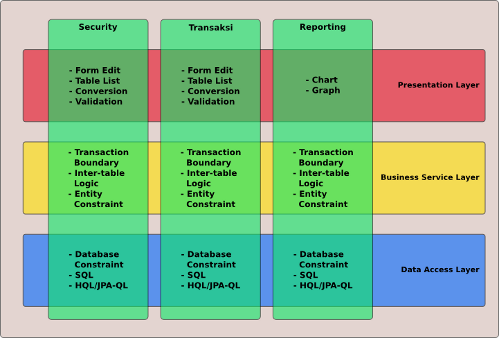
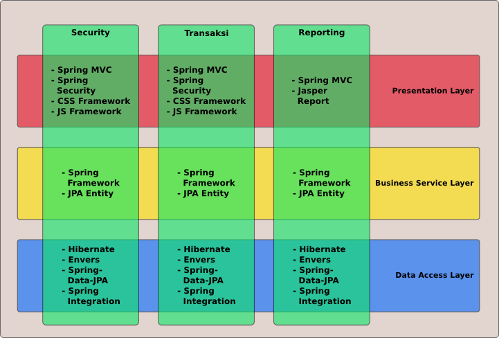
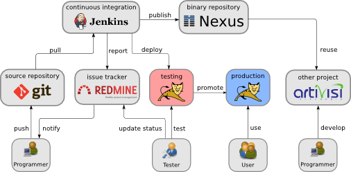
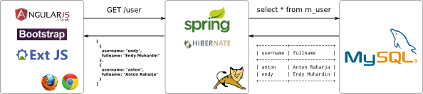
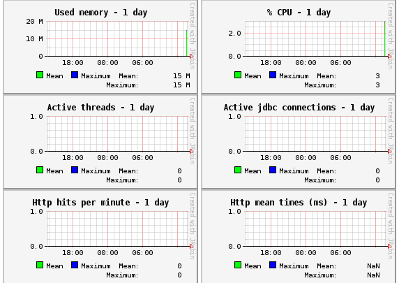
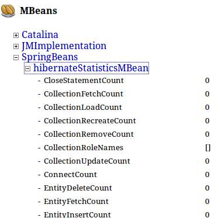

# Pendahuluan #

## Tentang Dokumen Teknis ##

Dokumen ini menjelaskan tentang arsitektur aplikasi standar di ArtiVisi, yaitu:

* bagaimana pembagian layer dan modul
* bagaimana aturan coding
* apa saja framework dan tools yang digunakan
* best-practices yang digunakan

## Tentang Template Aplikasi ArtiVisi ##

Template Aplikasi ArtiVisi dibuat menggunakan Maven Archetype. 
Maven Archetype adalah suatu tools yang berfungsi sebagai wizard. 
Pada waktu dijalankan, dia akan menanyakan beberapa variabel yang dibutuhkan, 
setelah itu akan membuatkan struktur project sesuai dengan yang kita inginkan.

## Profil Pembaca ##

Untuk bisa memahami hal-hal yang dibahas dalam dokumen ini, pembaca diasumsikan telah memiliki pemahaman tentang:

* Pemrograman dengan Java minimal versi 5
* Cara instalasi dan pemakaian database server, terutama MySQL
* Konsep dan Penggunaan Spring Framework
* Konsep dan Penggunaan Hibernate dan JPA
* Build Tools dengan Maven
* Automated Testing dengan JUnit 4

# Arsitektur Aplikasi #

Aplikasi ini dirancang dengan beberapa tujuan:

* modular: aplikasi dipecah menjadi beberapa modul agar bisa digunakan (reuse) di aplikasi lain

* layered: aplikasi dibagi menjadi layer tampilan, proses bisnis, dan akses data. Dengan pembagian ini, perubahan di satu layer dapat dilakukan secara independen tanpa mengganggu layer lainnya.

Untuk mencapai tujuan di atas, kita bisa membagi aplikasi menjadi dua dimensi yaitu vertical slice dan horizontal slice, seperti pada diagram berikut : 



## Vertical Slice ##

Vertical slice adalah membagi aplikasi sesuai fungsi dan fitur. Pembagian secara fungsional maksudnya adalah membagi aplikasi berdasarkan fiturnya. 
Contohnya, satu aplikasi besar bisa dipecah menjadi: 

* modul security management
* modul komunikasi dan notifikasi
* modul akunting dan keuangan
* modul pembelian
* dan fungsi-fungsi lainnya

Dengan pembagian ini, bagian-bagian yang memiliki fungsi umum seperti security atau user-management dapat digunakan lagi di aplikasi lain.

## Horizontal Slice ##

Horizontal slice artinya membagi aplikasi sesuai layer, misalnya tampilan, proses bisnis, dan akses data atau integrasi.

Berikut adalah penjelasan dari pembagian modul dalam bentuk diagram. Kita bisa membagi aplikasi secara fungsional sebagai berikut.

Secara fungsinya, aplikasi dibagi menjadi beberapa bagian sebagai berikut: 

* User Interface
* Web Service
* Business Service
* Data Access
* External Integration

### User Interface dan Web Service ###

Ini adalah bagian yang menangani interaksi dengan user. Tugas utama dari layer ini adalah: 

1. Menampilkan data dengan format yang sesuai (tabel, grafik, tulisan, dan sebagainya)
2. Menerima input dari user, misalnya menggunakan form 
3. Melakukan validasi terhadap input yang diberikan user 
(misalnya: field yang wajib diisi, format email, format tanggal, format angka, dan sebagainya)
4. Melakukan konversi terhadap data yang ingin ditampilkan, misalnya format tanggal, angka, jenis tampilan (chart atau tabel), dan sebagainya.

Seringkali aplikasi kita diakses tidak hanya oleh user manusia, tapi juga oleh aplikasi lain.
Untuk kebutuhan tersebut, kita menyediakan antarmuka request response yang berupa data saja tanpa ada dekorasi visual.
Format data yang digunakan adalah JSON, sehingga bisa langsung diproses dengan mudah oleh berbagai JavaScript library.

Berikut adalah framework dan library yang kita gunakan untuk layer ini.

* Spring MVC : untuk menyediakan web service berbasis REST
* Spring Security : untuk mengendalikan siapa saja yang bisa mengakses aplikasi
* CSS Framework : untuk memperindah tampilan. Framework yang saat ini kita gunakan adalah [Twitter Bootstrap](http://twitter.github.com/bootstrap/)
* JavaScript Framework : untuk implementasi kode program di sisi tampilan. Beberapa framework yang kita gunakan diantaranya:
    * [AngularJS](http://angularjs.org/)
    * [Dojo Toolkit](http://dojotoolkit.org/)
    * [ExtJS](http://www.sencha.com/products/extjs)
* Jasper Report : untuk membuat report dalam format PDF, DOC, atau XLS.

### Business Service ###

Di bagian ini, semua aturan proses bisnis kita implementasikan dalam bentuk kode program. Di antara tugas dari layer ini adalah: 

1. Mendefinisikan proses bisnis
2. Mengatur transaction boundary
3. Mengatur integrasi dengan business service untuk modul lain

Layer business service nantinya akan digunakan oleh User Interface Layer dan Web Service Layer dengan cara memanggil langsung object dan methodnya. 

Berikut adalah framework dan library yang kita gunakan untuk layer ini.

* Spring Framework : untuk integrasi antar komponen, mengelola resource, dan transaction management
* JPA Entity : untuk mapping dan konversi antara tabel di database relasional dan class di Java

### Data Access ###

Ini adalah bagian yang bertanggung jawab untuk menyimpan dan mencari data yang dibutuhkan oleh Business Service Layer.
Penyimpanan data bisa bermacam-macam, misalnya:

* database relasional
* NoSQL database
* Cache Server

Data Access Layer akan digunakan oleh Business Service Layer dengan cara memanggil langsung object dan methodnya.

Berikut adalah framework dan library yang kita gunakan untuk layer ini.

* Hibernate : untuk konversi SQL sesuai dengan jenis database
* Envers : untuk membuat audit log terhadap isi database
* Spring Data JPA : untuk mengurangi jumlah kode program yang harus ditulis

### External Integration ###

Jika kita membutuhkan interaksi dengan sistem lain, misalnya: 

* aplikasi orang lain
* email service
* sms service
* fax service
* messaging service
* dan sebagainya

maka kita akan implementasikan kode programnya di layer ini.

External Integration Layer akan digunakan oleh Business Service Layer dengan cara memanggil langsung object dan methodnya.

Berikut adalah framework dan library yang kita gunakan untuk layer ini.

* Spring Integration : untuk mengakses berbagai service seperti FTP, Email, SMS, dan sebagainya
* jPOS : untuk menangani koneksi ke sistem lain yang menggunakan protokol ISO-8583

Penjelasan di atas bisa digambarkan dalam diagram berikut.



\newpage

## Component Reuse ##

Untuk aplikasi Java, satu unit modul dipaketkan dalam bentuk file `jar`. File ini bisa disertakan dalam aplikasi lain bila kita ingin menggunakannya.

## Development Workflow ##

Maven adalah tools untuk melakukan kegiatan build di Java. Maven memiliki fitur dependency management, yaitu dia mampu mencari dan memasang semua dependensi yang dibutuhkan.

Dengan menggunakan Maven, kita dapat menggunakan modul yang sudah kita buat di aplikasi lain. Demikian juga kita dapat membagi modul yang kita baru saja buat untuk digunakan di aplikasi lain.

Dalam mencari dependensi, Maven akan mengakses file server yang disebut repository. Di internet ada repository besar yang memuat banyak library opensource seperti Spring Framework, Hibernate, dan sebagainya. Berbagai library ini disusun dalam struktur folder yang seragam sehingga mudah dicari dan digunakan.

Selain repository yang tersedia di internet, kita juga bisa membuat repository untuk kita gunakan secara internal dalam perusahaan. Aplikasi yang digunakan adalah Nexus. Nexus berbentuk aplikasi web yang diinstal di server. Untuk library atau modul yang hanya digunakan di internal, kita bisa menggunakan akses kontrol berupa username dan password agar modul internal kita tidak bisa diakses sembarang orang.

Untuk mengisi Nexus, aplikasi perlu dibuild dulu agar menghasilkan jar atau war. Jar atau war ini disebut dengan istilah _artifact_. Kegiatan build ini bisa diotomasi menggunakan aplikasi Continuous Integration seperti misalnya Jenkins. Jenkins akan mengambil source-code terbaru dari version control, melakukan build, dan mengunggah hasilnya ke Nexus. 

Skema workflow ini dapat dilihat pada diagram berikut:



\newpage

Kita bisa lihat pada diagram di atas bahwa artifact yang kita buat akan diunggah ke Nexus. 
Misalnya, kita membuat library untuk security dengan nama sebagai berikut:

* Group ID : com.artivisi.security
* Artifact ID : user-management
* Version : 1.2.3

Setelah diunggah ke Nexus, project lain bisa menggunakan artifact tersebut dengan memasang dependensi berikut di konfigurasi Maven (`pom.xml`): 

```xml
<dependency>
    <groupId>com.artivisi.security</groupId>
    <artifactId>user-management</artifactId>
    <version>1.2.3</version>
</dependency>
```

Maven otomatis akan mencari artifact tersebut, mengunduh ke folder lokal, dan mendaftarkannya di `CLASSPATH` sehingga bisa diimport dalam source code.

## REST dan Single Page Application ##

Aplikasi jaman sekarang biasanya dibuat menggunakan antar muka berbasis web. Tampilan diperindah menggunakan CSS, perilaku aplikasi dibuat menggunakan JavaScript, dan pertukaran data dilakukan dengan format JSON.

Aplikasi seperti ini biasanya hanya terdiri dari satu halaman/file HTML saja, sehingga disebut Single Page Application (SPA). Salah satu aplikasi populer yang dibuat dengan arsitektur SPA adalah Gmail.

Berikut adalah diagram aplikasi yang dibuat menggunakan arsitektur ini.



Ada banyak sekali pilihan library yang bisa digunakan untuk membuat aplikasi SPA. Di template ini kita menggunakan kombinasi berikut:

*  CSS : Twitter Bootstrap
*  JavaScript : AngularJS
*  Serverside : SpringMVC

Informasi lebih detail mengenai library dan framework di atas akan disampaikan pada bagian selanjutnya di bawah.

## Build Tools ##

Agar dapat mengelola aplikasi modular dengan mudah, kita membutuhkan tools untuk mengelola hubungan antar modul. 
Ada banyak alternatif tools yang tersedia, diantaranya: 

* Maven
* Ant + Ivy
* Gradle

Dari ketiga alternatif tersebut, kita akan menggunakan Maven karena paling populer.
Itu artinya dokumentasi banyak tersedia, demikian juga masalah-masalah yang umum terjadi telah ditemukan pemecahannya.

Fitur utama yang akan sangat bermanfaat bagi kita adalah dependency management. 
Misalnya aplikasi kita menggunakan library Hibernate. 
Hibernate ini membutuhkan library lain yang bernama cglib dan entah berapa banyak library lainnya. 
Dependensi lapis kedua dan seterusnya ini disebut dengan istilah _transitive dependency_.
Dengan menggunakan dependency management, kita cukup mengetahui bahwa aplikasi kita membutuhkan Hibernate. 
_Transitive dependency_ tidak perlu kita pusingkan.

### Dependency Management ###

Dependensi dalam aplikasi ditulis dalam file konfigurasi `pom.xml`. 
Berikut adalah contoh konfigurasi dependensi terhadap Spring Framework dan Hibernate. 

```xml
<dependencies>
		<dependency>
			<groupId>commons-logging</groupId>
			<artifactId>commons-logging</artifactId>
			<version>1.1.1</version>
			<scope>provided</scope>
		</dependency>
		<dependency>
			<groupId>org.slf4j</groupId>
			<artifactId>slf4j-api</artifactId>
			<version>1.7.2</version>
		</dependency>
		<dependency>
			<groupId>org.slf4j</groupId>
			<artifactId>jcl-over-slf4j</artifactId>
			<version>1.7.2</version>
			<scope>runtime</scope>
		</dependency>
		<dependency>
			<groupId>org.slf4j</groupId>
			<artifactId>log4j-over-slf4j</artifactId>
			<version>1.7.2</version>
			<scope>runtime</scope>
		</dependency>
</dependencies>
```

Untuk menyatakan dependensi di Maven, kita harus menyebutkan 3 variabel wajib dan 1 variabel tambahan, yaitu:

* groupId : biasanya organisasi yang membuat library
* artifactId : nama modul atau library
* version : versi library
* scope : kapan dependensi ini digunakan

Variabel scope tidak wajib. Bila kita tidak sebutkan akan diisi dengan nilai `compile`. 
Berikut adalah nilai yang bisa kita isikan untuk scope:

* compile : digunakan untuk kompilasi dan juga disertakan dalam produk akhir
* runtime : tidak dibutuhkan untuk kompilasi, tapi disertakan dalam produk akhir
* test : hanya dibutuhkan untuk test saja, tidak disertakan dalam produk akhir
* provided : dibutuhkan untuk kompilasi, tapi tidak disertakan dalam produk akhir karena sudah tersedia. 
Ini biasanya dipakai bila aplikasi akan dideploy di application server, sehingga library yang kita pakai sudah disediakan.

### Artifact Publishing ###

Bila kita bisa menggunakan library yang dibuat orang lain, 
tentu kita juga bisa mempublikasikan library yang kita buat agar bisa digunakan orang lain.
Agar bisa melakukan hal tersebut, kita butuh dua hal: 

* tools untuk mengunggah library
* tools untuk menerima unggahan dan menampilkan isinya agar bisa diunduh orang lain

Untuk mengunggah library, kita bisa menggunakan Maven. 
Sedangkan untuk menyimpan dan menampilkan hasilnya, kita bisa menggunakan Nexus.

Berikut adalah konfigurasi di Maven yang menyebutkan lokasi Nexus.

```xml
<distributionManagement>
	<!-- releases repository -->
	<repository>
		<id>artivisi-nexus</id>
		<name>ArtiVisi Release Repository</name>
		<url>
http://forge.artivisi.com:8080/nexus/content/repositories/releases
		</url>
	</repository>

	<!-- snapshot repository -->
	<snapshotRepository>
		<id>artivisi-nexus</id>
		<name>ArtiVisi Snapshot Repository</name>
		<url>
http://forge.artivisi.com:8080/nexus/content/repositories/snapshots
	    </url>
	</snapshotRepository>
</distributionManagement>
```

Agar bisa mengunggah, tentu kita harus menyediakan username dan password untuk mengakses Nexus. 
Username dan password ini kita tulis di file `settings.xml` yang berada di folder `.m2` dalam `HOME FOLDER` user komputer. 
Di sistem Linux, bila usernamenya adalah `endy`, maka `HOME FOLDER` adalah `/home/endy`.

Berikut isi dari `settings.xml`

```xml
<settings>
    <servers>
        <server>
            <id>artivisi-nexus</id>
            <username>admin</username>
            <password>admin123</password>
        </server>
    </servers>
</settings>
```

Bila menyimpan _plain text_ password seperti di atas terlalu mengerikan, 
kita bisa menyimpan password secara terenkripsi dengan mengikuti 
[panduan di websitenya Maven](http://www.sonatype.com/books/mvnref-book/reference/appendix-settings-sect-details.html#appendix-settings-sect-encrypting-passwords).

# Inisialisasi Project #

Untuk mulai membuat aplikasi, terlebih dulu kita harus membuat struktur folder sesuai dengan standar yang sudah kita tetapkan di atas. Maven memiliki fitur untuk menyiapkan struktur project sesuai kebiasaan kita, yaitu yang dinamakan dengan `archetype`.

## Maven Archetype ##

Maven archetype adalah seperangkat template untuk membuat project. ArtiVisi telah memiliki archetype untuk struktur project seperti yang telah dijelaskan di atas. Archetype ini dapat diambil di [Github](https://github.com/artivisi/standard-webapp-archetype/).

Pertama, kita harus menginstal dulu archetype tersebut di repository lokal. Jalankan perintah berikut di dalam folder archetype:

```
mvn clean install
```

Selanjutnya, kita dapat mulai membuat project. Posisikan command prompt kita di dalam folder dimana aplikasi akan disimpan. Kemudian jalankan perintah berikut:

```
mvn archetype:generate \
-DarchetypeGroupId=com.artivisi.template \
-DarchetypeArtifactId=standard-webapp-archetype
```

Kita an ditanyai beberapa pertanyaan sebagai berikut:

* groupId : nama modul kita, biasanya nama package induk dari aplikasi. Misalnya `com.artivisi.akunting`
* artifactId : nama aplikasi kita tanpa spasi. Misalnya `akunting`
* project-name : nama aplikasi dalam bentuk manusiawi, misalnya `Aplikasi Akunting`

Setelah semua dijawab, Maven akan mulai membuat struktur folder untuk aplikasi.

## Struktur Folder ##

Struktur folder yang dihasilkan archetype adalah sebagai berikut:

* config : berisi konfigurasi untuk keseluruhan aplikasi, misalnya koneksi database, logging, dan sebagainya
* domain : berisi Java class yang memuat mapping table, constraint dan relasi, juga interface berisi daftar proses bisnis yang dilayani modul ini
* service : berisi implementasi proses bisnis berupa kode program Java dan query database (HQL, JPAQL, QueryDSL, dan sebagainya).
* web : mengexpose proses bisnis dengan protokol REST. Kita juga bisa menambahkan user interface menggunakan HTML dan framework JavaScript seperti AngularJS, ExtJS, ataupun Dojo Toolkit.

## Inisialisasi Database ##

Sebelum memulai proses build, terlebih dulu kita siapkan database. 
Konfigurasi awal (default) dari archetype ini adalah sebagai berikut: 

* Tipe database : MySQL 5
* Nama database : sesuai format `artifactId_development`, misalnya `akunting_development`.
* Username database : root
* Password database : admin

Bila kita ingin menggunakan konfigurasi selain di atas, kita harus mengedit file `pom.xml` di project induk dan mengganti di baris berikut: 

```xml
<!-- konfigurasi database development -->
<hibernate.dialect>isi hibernate dialect di sini</hibernate.dialect>
<db.driver>JDBC Driver Class</db.driver>
<db.url><![CDATA[URL Database]]></db.url>
<db.username>username database</db.username>
<db.password>password database</db.password>
```

## Proses Build ##

Setelah database disiapkan, kita bisa menjalankan proses build dengan perintah

```
mvn clean install
```

Maven akan mengunduh semua library yang dibutuhkan, kemudian melakukan kompilasi, menjalankan semua tes, dan melakukan packaging untuk membentuk hasil akhir berupa `jar` dan `war` sesuai modulnya.

Bila proses build dijalankan dengan sukses, di akhir log akan muncul tulisan `BUILD SUCCESSFUL`.

## Test Report  ##

Dalam modul `service` dan `web` ada serangkaian tes otomatis yang dijalankan oleh Maven. 
Hasil tesnya disimpan dalam folder `target/failsafe-reports` di masing-masing modul tersebut. 
Bila hasil akhir proses build adalah `BUILD FAILURE`, kita harus memeriksa isi folder tersebut 
dan membaca isinya untuk mengetahui penyebab terjadinya error.

## Menjalankan Aplikasi ##

Setelah aplikasi sukses dibuild, kita dapat menjalankan aplikasi dengan menggunakan _application server_ 
Jetty yang dipasang sebagai plugin Maven. Berikut cara menjalankannya:

1. Pindah ke folder web

            cd akunting-web

2. Jalankan perintah berikut: 

            mvn jetty:run

3. Browse ke `http://localhost:10000`

# Tools, Library, dan Framework #

## Liquibase ##

Liquibase adalah tools untuk memelihara versioning pada database. Dengan Liquibase, kita dapat:

1. Menandai (tagging) rilis aplikasi versi tertentu
2. Membuat rilis selanjutnya yang mengandung perubahan skema database
3. Bila terjadi error, kita bisa mengembalikan (rollback) skema database ke versi sebelumnya

Perubahan skema database ditulis dalam file changelog. Berikut adalah contoh file changelog untuk membuat tabel di database.

```xml
<databaseChangeLog xmlns="http://www.liquibase.org/xml/ns/dbchangelog"
xmlns:xsi="http://www.w3.org/2001/XMLSchema-instance"
xsi:schemaLocation="
http://www.liquibase.org/xml/ns/dbchangelog 
http://www.liquibase.org/xml/ns/dbchangelog/dbchangelog-2.0.xsd
">
    <changeSet id="1" author="endy">
        <createTable tableName="c_application_config">
            <column name="id" type="varchar(255)">
                <constraints primaryKey="true" nullable="false" />
            </column>
            <column name="name" type="varchar(255)">
                <constraints unique="true" nullable="false" />
            </column>
            <column name="label" type="varchar(255)">
                <constraints nullable="false" />
            </column>
            <column name="value" type="varchar(255)">
                <constraints nullable="false" />
            </column>
        </createTable>
    </changeSet>
</databaseChangeLog>
```

Selain membuat tabel, Liquibase juga memiliki beberapa fitur lain diantaranya:

* mendefinisikan relasi foreign key
* mendefinisikan constraint seperti primary key, unique, dan lainnya
* mengisi data dari file csv
* mengembalikan skema database ke versi sebelumnya

## Spring Framework ##

Spring Framework digunakan untuk mengintegrasikan berbagai komponen dalam aplikasi.
Komponen yang biasanya digunakan adalah: 

* koneksi database dalam bentuk connection pooling
* transaction management
* session factory Hibernate

Berikut adalah contoh dependency maven untuk spring framework :

```xml
  <dependency>
  	<groupId>org.springframework</groupId>
  	<artifactId>spring-orm</artifactId>
  	<version>3.1.3.RELEASE</version>
  </dependency>
```

Konfigurasi Spring Framework dibuat berupa file XML. 
Untuk memudahkan kita mengeditnya, kita bisa gunakan namespace, sehingga editor yang kita gunakan (seperti Eclipse dan Netbeans)
bisa menyediakan autocomplete. Berikut adalah contoh deklarasi namespace.

```xml
<beans xmlns="http://www.springframework.org/schema/beans"
       xmlns:context="http://www.springframework.org/schema/context"
       xmlns:tx="http://www.springframework.org/schema/tx"
       xmlns:p="http://www.springframework.org/schema/p"
       xmlns:xsi="http://www.w3.org/2001/XMLSchema-instance"
       xsi:schemaLocation="
        http://www.springframework.org/schema/beans 
        http://www.springframework.org/schema/beans/spring-beans-3.1.xsd
        http://www.springframework.org/schema/context
        http://www.springframework.org/schema/context/spring-context-3.1.xsd
        http://www.springframework.org/schema/tx
        http://www.springframework.org/schema/tx/spring-tx-3.1.xsd
">
```

Dalam mengkonfigurasi database, biasanya informasi tentang server database kita letakkan di file `jdbc.properties`. 
Berikut adalah konfigurasi Spring agar membaca file `jdbc.properties` :

```xml
<context:property-placeholder
    location="classpath*:jdbc.properties" />
```

Berikut isi file `jdbc.properties`

```
hibernate.dialect = org.hibernate.dialect.MySQL5InnoDBDialect
jdbc.driver = com.mysql.jdbc.Driver
jdbc.url = jdbc:mysql://localhost/belajar
jdbc.username = root
jdbc.password = admin
```

Variabel yang kita definisikan dalam `jdbc.properties` akan digunakan untuk membuat koneksi database. Berikut konfigurasi koneksi database: 

```xml
<bean id="dataSource" 
        class="org.apache.commons.dbcp.BasicDataSource"
		destroy-method="close" 
		p:driverClassName="${jdbc.driver}" 
		p:url="${jdbc.url}"
		p:username="${jdbc.username}" 
		p:password="${jdbc.password}" 
		p:maxWait="40000"
		p:maxActive="80" 
		p:maxIdle="20" 
/>
```

`${jdbc.driver}` adalah variable yang dibaca dari `jdbc.properties`.

Berbagai implementasi kode program kita akan diload dan dihubungkan oleh Spring dengan komponen yang dibutuhkan, misalnya:

* Class Service membutuhkan SessionFactory
* Class Controller membutuhkan class Service

Agar Spring mendeteksi kode program kita secara otomatis, kita bisa menambahkan anotasi yang disediakan oleh Spring, seperti misalnya `@Service`, `@Controller`, `@Repository`, dan sebagainya. 
Berikut adalah konfigurasi Spring agar mencari class yang memiliki anotasi tersebut di dalam package `com.artivisi.training.service`: 
    
```xml
<context:component-scan 
    base-package="com.artivisi.training.service" 
/>
```

## Hibernate ##

Hibernate gunanya untuk melakukan mapping dari schema tabel database ke class di java.
Informasi mapping ditulis di class java sebagai berikut :

```java
@Entity
@Table(name = "c_security_user")
public class User {
    @Id
    @GeneratedValue(generator = "system-uuid")
    @GenericGenerator(name = "system-uuid", strategy = "uuid2")
    private String id;

    @NotNull
    @NotEmpty
    @Column(name = "username", nullable = false, unique = true)
    private String username;
}
```

Pada contoh kode di atas ada beberapa annotation hibernate, yaitu :

* Entity : Digunakan untuk menandai bahwa class tersebut memiliki pasangan tabel di database.
* Table : Digunakan untuk menentukan nama tabel di database.
* Id : Digunakan untuk menandai primary key.
* GeneratedValue : Digunakan agar primary key otomatis digenerate, tidak diisi manual oleh user.
* GenericGenerator : Digunakan untuk menentukan algoritma yang digunakan untuk membuat primary key.
* NotNull : menyatakan bahwa kolom tersebut harus diisi
* NotEmpty : menyatakan bahwa kolom tersebut tidak boleh berisi String kosong
* Column : digunakan untuk menambahkan atribut tambahan seperti unique constraint, nama tabel, dan sebagainya

Agar bisa digunakan di aplikasi, hibernate harus di konfigurasi dulu menggunakan spring. Berikut adalah konfigurasinya :


```xml
<bean id="entityManagerFactory"
      class="org.springframework.orm.jpa.LocalContainerEntityManagerFactoryBean">
  <property name="dataSource" ref="dataSource" />
  <property name="packagesToScan" value="com.artivisi.training.domain" />
  <property name="jpaVendorAdapter">
    <bean 
      class="org.springframework.orm.jpa.vendor.HibernateJpaVendorAdapter">
        <property 
          name="databasePlatform" 
          value="org.hibernate.dialect.MySQL5InnoDBDialect" 
        />
        <property name="showSql" value="true" />
        <property name="generateDdl" value="true" />
    </bean>
  </property>
  <property name="jpaProperties">
    <props>
        <prop key="hibernate.format_sql">true</prop>
        <prop key="hibernate.hbm2ddl.auto">update</prop>
    </props>
  </property>
</bean>
```

EntityManagerFactory adalah class utama yang akan kita gunakan di aplikasi. Berikut penjelasan dari konfigurasi EntityManagerFactory :

* packagesToScan : nama package yang isinya entityClass.
* databasePlatform : untuk menentukan type database yang digunakan.
* showSql : untuk menampilkan query yang dilakukan kedalam log.
* generateDdl : untuk mengaktifkan atau menonaktifkan pembuatan tabel dari JPA.
* format_sql : untuk merapikan format query yang akan tampil di log.
* hbm2ddl.auto : untuk menggenerate tabel secara otomatis.

Agar kegiatan akses database menggunakan fitur transaction, kita harus mengaktifkannya dulu dengan konfigurasi berikut:

```xml
<bean class="org.springframework.orm.jpa.JpaTransactionManager"
      id="transactionManager">
    <property name="entityManagerFactory" 
              ref="entityManagerFactory" />
    <property name="jpaDialect">
        <bean 
          class="org.springframework.orm.jpa.vendor.HibernateJpaDialect"
        />
    </property>
</bean>
```


## Spring Data JPA ##

Spring Data JPA adalah library tambahan di atas Hibernate dan JPA, gunanya untuk mengurangi jumlah baris kode yang harus ditulis. 
Sebelum menggunakan Spring Data JPA, kita harus menulis kode seperti ini: 

```java
public class XxxServiceImpl {
    public void save(Produk p){
        sessionFactory.getCurrentSession()
        .saveOrUpdate(p);
    }
    public void delete(Produk p){
        sessionFactory.getCurrentSession()
        .delete(p);
    }
    public Long countAllProduct(){
        return (Long) sessionFactory.getCurrentSession()
        .createQuery("select count(p) from Produk p")
        .uniqueResult();
    }
    public List<Produk> findAllProduct(Integer start, Integer rows){
        return sessionFactory.getCurrentSession()
        .createQuery("select count(p) from Produk p")
        .setFirstResult(start)
        .setMaxResult(rows)
        .list();
    }
}
```

Setelah menggunakan Spring Data JPA, maka fungsi yang sama dengan di atas dapat diimplementasikan dengan satu baris kode berikut:

```java
public interface ProdukDao 
    extends PagingAndSortingRepository<Produk, String> {}
```


## Spring MVC ##

Spring MVC adalah framework yang berguna untuk: 

* menerima request HTTP
* melakukan konversi dari JSON menjadi Java Object dan sebaliknya
* melakukan validasi

Untuk mengaktifkan Spring MVC, kita tambahkan konfigurasi berikut pada `web.xml`:

```xml
<web-app>
	<servlet>
		<servlet-name>belajar</servlet-name>
		<servlet-class>
		    org.springframework.web.servlet.DispatcherServlet
	    </servlet-class>
		<load-on-startup>1</load-on-startup>
	</servlet>

	<servlet-mapping>
		<servlet-name>belajar</servlet-name>
		<url-pattern>/app/*</url-pattern>
	</servlet-mapping>
</web-app>
```

Kita juga harus menyediakan file bernama `belajar-servlet.xml` di folder yang sama dengan `web.xml`. 
Nama file disesuaikan dengan nama servlet. 

Berikut adalah isi file tersebut


```xml
<?xml version="1.0" encoding="UTF-8"?>
<beans xmlns="http://www.springframework.org/schema/beans"
		xmlns:mvc="http://www.springframework.org/schema/mvc"
		xmlns:xsi="http://www.w3.org/2001/XMLSchema-instance"
		xsi:schemaLocation="
		http://www.springframework.org/schema/beans 
		http://www.springframework.org/schema/beans/spring-beans-3.1.xsd
		http://www.springframework.org/schema/mvc 
		http://www.springframework.org/schema/mvc/spring-mvc-3.1.xsd">
	<mvc:annotation-driven />
	<context:component-scan 
	    base-package="com.artivisi.training.controller" />
</beans>
```

## Spring Security ##

Spring Security adalah framework yang menyediakan fungsi akses kontrol terhadap aplikasi.
Spring Security dipasang sebagai `Filter` dalam file `web.xml` sebagai berikut:

```xml
<filter>
    <filter-name>springSecurityFilterChain</filter-name>
    <filter-class>
        org.springframework.web.filter.DelegatingFilterProxy
    </filter-class>
</filter>

<filter-mapping>
    <filter-name>springSecurityFilterChain</filter-name>
    <url-pattern>/*</url-pattern>
</filter-mapping>
```

Selanjutnya, kita juga harus memanggil konfigurasi Spring Security sebagai berikut:

```xml
<context-param>
    <param-name>contextConfigLocation</param-name>
    <param-value>
        classpath:net/bull/javamelody/monitoring-spring.xml
        classpath*:com/artivisi/**/applicationContext.xml
        /WEB-INF/spring-security.xml
    </param-value>
</context-param>
```

Konfigurasi di atas akan dibaca oleh `ContextLoaderListener`, 
yang bertugas menginisialisasikan Spring Framework sesuai dengan daftar file konfigurasi di atas.
Berikut adalah konfigurasi untuk `ContextLoaderListener` dalam `web.xml`.

```xml
<listener>
    <listener-class>
        org.springframework.web.context.ContextLoaderListener
    </listener-class>
</listener>
```

## Logging Framework ##

Logging framework yang kita gunakan adalah [Logback](http://logback.qos.ch).
Berikut adalah contoh konfigurasi Logback.

```xml
<configuration>

	<appender name="STDOUT" 
	            class="ch.qos.logback.core.ConsoleAppender">
		<encoder>
			<pattern>%d %-5level %logger{35} - %msg %n</pattern>
		</encoder>
	</appender>

	<appender name="FILE" class="ch.qos.logback.core.FileAppender">
		<file>
            ${catalina.home:-.}/logs/aplikasi.log
	    </file>
		<encoder>
			<pattern>%d %-5level %logger{35} - %msg %n</pattern>
		</encoder>
	</appender>

	<logger name="org.hibernate.type" level="TRACE">
		<appender-ref ref="STDOUT" />
		<appender-ref ref="FILE" />
	</logger>

	<logger name="org.hibernate.SQL" level="TRACE">
		<appender-ref ref="STDOUT" />
		<appender-ref ref="FILE" />
	</logger>

	<logger name="com.artivisi.belajar" level="DEBUG">
		<appender-ref ref="STDOUT" />
		<appender-ref ref="FILE" />
	</logger>

	<root level="INFO">
		<appender-ref ref="STDOUT" />
		<appender-ref ref="FILE" />
	</root>

</configuration>

```

Berikut adalah penjelasan untuk konfigurasi di atas:

* ada dua appender yang diaktifkan, yaitu `STDOUT` dan `FILE`. 
Appender adalah komponen yang bertugas menuliskan log statement. 
Pada konfigurasi di atas, kita memiliki dua appender, 
`STDOUT` menulis ke layar, dan `FILE` menulis ke file `aplikasi.log`.

* Kita memiliki tiga logger yang dikonfigurasi secara khusus. 
Logger adalah komponen aplikasi yang mengeluarkan log statement. 
Kita mengatur level log statement dan appender yang melayaninya.

* Untuk komponen aplikasi yang tidak dikonfigurasi khusus, 
akan mengikuti konfigurasi `root`.

## JUnit ##

JUnit adalah framework yang digunakan untuk melakukan pengetesan secara otomatis. 
Dengan adanya pengetesan otomatis, ada beberapa keuntungan antara lain:

* siklus development menjadi lebih cepat, karena tidak perlu mendeploy keseluruhan aplikasi hanya untuk mengetes satu method/function saja
* pemeriksaan terhadap hasil eksekusi method dilakukan oleh komputer sehingga lebih teliti
* pengetesan dapat dilakukan berulang-ulang setiap kali aplikasi dikompilasi, sehingga programmer menjadi lebih tenang dalam melakukan perubahan terhadap kode program

Berikut contoh kode program untuk mengetes method `findById` yang mencari data user di database berdasarkan primary key.

```java
public class UserServiceTestIT {

    @Autowired
    private BelajarRestfulService service;

    @Test
    public void testFindById() {
        User ac = service.findUserById("endy");
        assertNotNull(ac);
        assertEquals("endy", ac.getUsername());
        assertEquals("Endy Muhardin", ac.getFullname());
        assertEquals("123", ac.getPassword());
        assertEquals(Boolean.TRUE, ac.getActive());
        assertEquals("Super User", ac.getRole().getName());
        
        assertNull(service.findUserById(null));
        assertNull(service.findUserById(""));
    }

    @Test
    public void testFindAll() {
        Page<User> result = service.findAllUsers(
            new PageRequest(0, service.countAllUsers().intValue()));
        assertTrue(result.getTotalElements() > 0);
    }

    @Test
    public void testFindByUsername() {
        assertNotNull(service.findUserByUsername("endy"));
        assertNull(service.findUserByUsername("adi"));
    }
}
```
 
Perintah berawalan `assert` seperti `assertEquals` dan `assertNull` adalah fitur JUnit untuk membandingkan hasil eksekusi dan hasil yang seharusnya didapatkan. Bila tidak sesuai, maka tes akan dinyatakan gagal (failure).

## DBUnit ##

DBUnit adalah library untuk membantu pengetesan terhadap query database. Agar tes lebih mudah dilakukan dan hasilnya lebih konsisten, kita membutuhkan contoh data yang konsisten juga di database. 

DBUnit mengisi database dengan seperangkat data contoh sebelum tes dijalankan, sehingga kita bisa melakukan tes dengan mudah karena kita yakin apa isi database sebelum tes dijalankan.

Data contoh ditulis dalam bentuk xml seperti ini:

```xml
<?xml version="1.0" encoding="UTF-8"?>
<dataset>
    <c_application_config
        id="abc123"
        name="applicationname"
        label="Application Name"
        value="Belajar Restful"
    />
    
    <c_application_config
        id="def456"
        name="applicationversion"
        label="Application Version"
        value="1.0"
    />
</dataset>
```

Contoh data di atas dibaca dan diisikan ke database di dalam JUnit sebagai berikut:

```java
@Before
public void resetDatabase() throws Exception {

    IDataSet[] daftarDataset = new IDataSet[]{
            new FlatXmlDataSetBuilder()
            .build(new File("src/test/resources/sample-data.xml"))
    };

    Connection conn = dataSource.getConnection();
    DatabaseOperation.CLEAN_INSERT
            .execute(new DatabaseConnection(conn),
                    new CompositeDataSet(daftarDataset));
}
```

Anotasi `@Before` memberikan instruksi pada JUnit untuk menjalankan method tersebut **sebelum masing-masing** method test dijalankan.

## Rest Assured ##

Rest Assured adalah library pembantu untuk memudahkan pengetesan web service berbasis REST. 
Dia memiliki serangkaian method yang mudah dibaca (fluent-API), sehingga kode test menjadi lebih mudah dimengerti.

Berikut contohnya:

```java
@Test
public void testGetExistingById() {
    String target = "http://localhost:10000/user";
    with().header("Accept", "application/json")
            .auth().form(username, password, 
                new FormAuthConfig(login, "j_username", "j_password"))
            .expect()
            .statusCode(200)
            .body("id", equalTo("endy"),
            "username", equalTo("endy"),
            "fullname", equalTo("Endy Muhardin")).when()
            .get(target + "/" + "endy");
}
```

Kode di atas akan mengakses URL `http://localhost:10000/user/endy` dengan konfigurasi berikut:

* sertakan HTTP Header dengan nama `Accept` dan nilai `application/json`
* lakukan dulu proses login
* akses URL `http://localhost:10000/user/endy`

kemudian, dia akan memastikan bahwa:

* [HTTP Status Code](http://en.wikipedia.org/wiki/List_of_HTTP_status_codes) bernilai 200
* Response body berisi:
    * variabel `id` dengan nilai `endy`
    * variabel `username` dengan nilai `endy`
    * variabel `fullname` dengan nilai `Endy Muhardin`

## Surefire dan Failsafe ##

Surefire dan Failsafe Plugin adalah plugin Maven yang bertugas menjalankan semua method yang dianotasi dengan `@Test`
dengan menggunakan JUnit.

Hasil eksekusi dilaporkan dalam folder `target/surefire-reports` dan  
`target/failsafe-reports`. 

Bila test sukses dijalankan, hasil laporannya terlihat seperti ini 

```
-------------------------------------------------------------------------
Test set: com.artivisi.belajar.restful.ui.controller.UserControllerTestIT
-------------------------------------------------------------------------
Tests run: 5, Failures: 0, Errors: 0, Skipped: 0, Time elapsed: 0.679 sec
```

Sedangkan bila terjadi kesalahan, berikut laporannya:

```
---------------------------------------------------------------------
Test set: com.artivisi.belajar.restful.service.impl.UserServiceTestIT
---------------------------------------------------------------------
Tests run: 3, Failures: 1, Errors: 0, Skipped: 0
Time elapsed: 8.33 sec <<< FAILURE!
testFindById(com.artivisi.belajar.restful.service.impl.UserServiceTestIT)
Time elapsed: 7.104 sec  <<< FAILURE!
org.junit.ComparisonFailure: expected:<endy[muhardin]> but was:<endy[]>
```

Dari hasil laporan di atas terlihat bahwa seharusnya nilai yang didapatkan (expected value) adalah `endymuhardin`, 
sedangkan hasil eksekusi method (actual value) menghasilkan `endy`.

## Java Melody ##

JavaMelody adalah aplikasi untuk memonitor aplikasi kita pada saat dijalankan. 
Cukup dipasang sebagai `listener` dan `filter` dengan konfigurasi berikut dalam `web.xml`

```xml
<listener>
    <listener-class>net.bull.javamelody.SessionListener</listener-class>
</listener>

<filter>
    <filter-name>monitoring</filter-name>
    <filter-class>net.bull.javamelody.MonitoringFilter</filter-class>
</filter>
<filter-mapping>
    <filter-name>monitoring</filter-name>
    <url-pattern>/*</url-pattern>
</filter-mapping>
```

JavaMelody akan menghasilkan beberapa report, misalnya pemakaian resource



\newpage

Pada screen di atas, kita bisa memantau: 

* penggunaan CPU
* penggunaan memori
* jumlah thread
* jumlah koneksi database
* jumlah request dari user
* dan sebagainya

Kita juga bisa melihat statistik aktifitas Hibernate seperti pada gambar berikut.



\newpage

Bukan hanya Hibernate, tapi semua object Java yang berupa `MBeans` bisa dipantau melalui halaman web yang tersedia.

